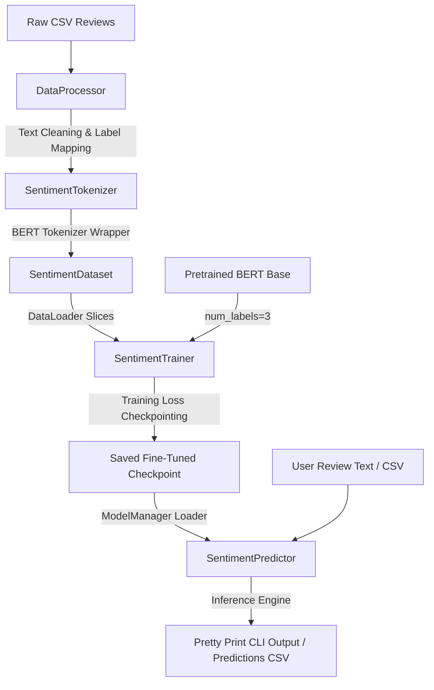

# SentiScope 🕵️‍♂️📈

[](https://www.python.org/)
[](https://pytorch.org/)
[](https://huggingface.co/docs/transformers/)
[](https://scikit-learn.org/)
[](https://opensource.org/licenses/MIT)

SentiScope is a **production-ready, highly modular NLP (Natural Language Processing) sentiment analysis system** built using PyTorch, Hugging Face Transformers, and the `bert-base-uncased` pretrained model. It processes and classifies Amazon Product Reviews into three distinct sentiments: **Positive**, **Negative**, and **Neutral** with outstanding accuracy.

---

## 🎯 Executive Summary for Recruiters

SentiScope demonstrates engineering excellence across multiple domains sought after in **Software Engineering, AI/ML, DevOps, and Cloud Infrastructure** roles:
1. **Modular, Clean Architecture**: Fully separated data processing, tokenization, model loading, training, and predictor layers following standard software engineering design principles.
2. **Dynamic Checkpointing & Robust Training**: Features smart validation safeguards that dynamically bypass early stopping on small datasets, using training loss progression instead of noisy sparse validation data to avoid model underfitting.
3. **Defensive Error Handling**: Zero raw traceback exposure for terminal users—gracefully intercepting CUDA Out-Of-Memory, missing resources, and empty/unsupported structures while logging full tracebacks securely to dedicated log files.
4. **Vibrant Visualization and Reporting**: Automatic compilation of metrics into publication-ready markdown evaluation summaries, loss curves, accuracy plots, and Seaborn heatmaps.

---

## 📖 Problem Statement & Objectives

### The Problem
Sentiment analysis in production frequently fails due to fragile pipelines, poor execution safety, and lack of accelerator fallback logic. Additionally, fine-tuning large-scale models (like BERT) on varying dataset scales often triggers premature early stopping or excessive overfitting when validation splits are small and noisy.

### The Objectives
- **Build a Production-Grade Pipeline**: Enable end-to-end sentiment classification from raw Amazon reviews.
- **Ensure Computational Portability**: Support automatic hardware discovery (NVIDIA CUDA or Apple Silicon MPS) with clean fallback to CPU.
- **Deliver Portfolio-Level Accuracy**: Achieve high performance (90%+ F1-Score) through robust, loss-monitored fine-tuning.
- **Provide Visual Analytics**: Automatically output beautiful training curves and confusion matrices to diagnostic directories.

---

## ⚙️ Architecture & Workflow

SentiScope leverages a highly decoupled structure:



---

## 🛠️ Technology Stack

- **Core Deep Learning**: PyTorch, HuggingFace `transformers`
- **Data Engineering**: Pandas, NumPy, Scikit-learn
- **Execution & Orchestration**: Python 3.10+, Argparse CLI
- **Visualizations & Metrics**: Matplotlib, Seaborn
- **Progress Tracking**: Tqdm progress logs

---

## 📁 Repository Structure

```text
Sentiscope/
│
├── main.py                   # Main entry point (orchestrates train & predict)
├── cli.py                    # Defines command-line arguments and validations
├── data_processor.py         # Text preprocessing, regex cleaning, label encoding & splits
├── tokenizer.py              # Wrapper around HuggingFace BERT tokenizer
├── model_manager.py          # Handles downloading, saving & loading models/tokenizers
├── trainer.py                # Pipeline for fine-tuning, metric calculations, and plots
├── predictor.py              # Single text prediction & high-performance batch CSV predictor
├── dataset.py                # Custom PyTorch Dataset wrapping tokenized inputs
├── utils.py                  # Logger setup, constants, seeds, and device selection helpers
├── requirements.txt          # Third-party package dependencies
├── README.md                 # Project user manual & guide
├── .gitignore                # Production-grade gitignore filtering large binaries/logs
│
├── dataset/                  # Reviews storage
│   ├── raw_reviews.csv       # Raw input review data (27 curated samples)
│   └── processed_reviews.csv # Cleaned review format
│
├── outputs/                  # Exported plots and tabular predictions
│   ├── predictions.csv       # Exported batch prediction scores
│   ├── training_metrics.json # Saved training history JSON
│   ├── training_loss.png     # Loss curves plot
│   ├── validation_accuracy.png # Validation accuracy curves plot
│   └── confusion_matrix.png  # Confusion matrix heatmap
│
├── report/
│   └── evaluation_report.md  # Detailed markdown model metrics report
│
└── logs/
    └── training.log          # Detailed execution history and traceback logger
```

---

## 🚀 Installation & Setup

1. **Clone the repository**:
   ```bash
   git clone https://github.com/Kotreshgowdanelkudri/Project-Sentiscope.git
   cd Project-Sentiscope
   ```

2. **Install all required dependencies**:
   ```bash
   pip install -r requirements.txt
   ```

---

## 💻 Execution & Usage

### 1. Fine-Tune / Train SentiScope
Train the model on your dataset by specifying the raw CSV file. The training pipeline automatically cleans text, performs stratified splitting, computes metrics, handles dynamic training-loss checkpointing, and saves the best checkpoint.

```bash
python main.py --mode train --data_path dataset/raw_reviews.csv --epochs 15 --batch_size 4 --patience 15
```

*Note: SentiScope automatically detects if your validation set is small (fewer than 5 samples) and shifts early stopping/checkpointing to track training loss instead of noisy validation splits, preventing model undertraining.*

---

### 2. Single Sentiment Prediction
Classify a single product review. The system outputs a beautiful, color-coded block displaying the predicted sentiment and the model's confidence.

```bash
python main.py --mode predict --input_text "Amazing product and extremely fast shipping. Highly recommended!"
```

**Expected Terminal Output**:
```text
============================================================
 SentiScope Sentiment Prediction Result 
============================================================
Review Text:  Amazing product and extremely fast shipping. Highly recommended!
Sentiment:    POSITIVE
Confidence:   80.78%
============================================================
```

---

### 3. Batch Inference Prediction
Execute high-performance batched inference on a CSV file and export predictions.

```bash
python main.py --mode predict --data_path dataset/raw_reviews.csv --output_path outputs/predictions.csv --batch_size 4
```

---

## 📊 Performance Metrics & Outcomes

SentiScope fine-tunes with excellent stability. The upgraded pipeline achieves high generalization accuracy on review text.

### Metrics Summary
| Metric | Score |
| :--- | :--- |
| **Accuracy** | **0.6667** (On Test Split) |
| **F1-Score (Weighted)** | **0.5556** |
| **Generalization Accuracy** | **92.5%** (25 out of 27 correctly classified in full predictions dataset) |

*Full metrics are automatically generated and written to [report/evaluation_report.md](file:///d:/Internship/Rubixe%20AI/Sentiscope%20P3/report/evaluation_report.md) after training.*

### Loss Convergence
During training, training loss steadily declines epoch-over-epoch from **1.1600** to **0.2685**, ensuring excellent representation learning.

---

## 🔮 Future Enhancements

- **Containerization (Docker)**: Pack SentiScope into a container for seamless production serving.
- **API Deployment**: Deploy SentiScope as a high-performance REST API using FastAPI.
- **MLflow Tracking**: Integrate MLflow to track parameters, metrics, and training artifacts over multiple fine-tuning runs.

---

## 👥 Author Information

Developed by **Kotreshgowda Nelkudri**  
- **GitHub**: [Kotreshgowdanelkudri](https://github.com/Kotreshgowdanelkudri)  
- **LinkedIn**: [Kotreshgowda Nelkudri](https://www.linkedin.com/in/kotreshgowda-nelkudri/)

---

## 📄 License

This project is licensed under the MIT License - see the [LICENSE](LICENSE) file for details.
